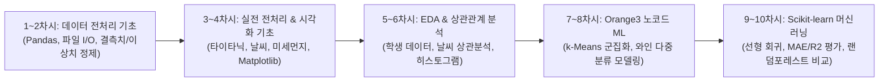
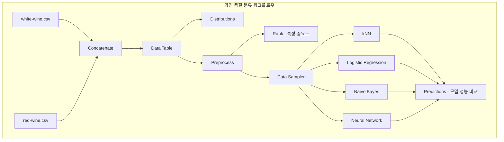

# AI-Subject: 인공지능 과목 학습 및 실습 정리

Git 커밋 로그와 실습 코드를 바탕으로 체계적으로 정리한 인공지능(AI) 교과 차시별 학습 기록 및 코드 아카이브입니다.  
데이터 파일 입출력 및 전처리부터 탐색적 데이터 분석(EDA), Orange3를 활용한 노코드 머신러닝, Scikit-learn을 이용한 회귀 모델 학습 및 오차값(MAE, R²) 비교 평가까지의 전 과정을 다룹니다.

---

## 구조 (Repository Structure)

```text
Artificial-Intelligence-Subject/
├── README.md                           # 전체 차시별 학습 및 코드 정리 문서
├── delivery_1312.ows                   # 7~8차시: Orange3 배달 데이터 k-Means 군집화 워크플로우
├── model_test.ows                      # 7~8차시: Orange3 와인 데이터 신경망 테스트 워크플로우
├── wine_model.ows                      # 7~8차시: Orange3 와인 품질 다중 분류 모델링 워크플로우
├── datas/                              # 실습용 데이터셋 디렉토리
│   ├── club.xlsx / new_club.xlsx       # 동아리 회원 데이터
│   ├── data_preprocess.xlsx            # 결측치/이상치/중복치 실습 데이터
│   ├── my_grade.xlsx                   # 성적 데이터
│   ├── dust_pm25.xlsx                  # 전국 시도별 초미세먼지(PM2.5) 데이터
│   ├── student.csv                     # 학생 학습시간, 출석률, 점수 데이터
│   ├── weather2023.xlsx / 2026.xlsx    # 기상청 날씨 데이터 (기온, 풍속, 습도, 전운량, 일조시간 등)
│   ├── delivery.csv                    # 배달 주문 데이터
│   ├── titanic/ (train.csv, test.csv)  # 타이타닉 탑승객 생존 데이터셋
│   └── wine+quality/                   # 레드/화이트 와인 품질 데이터셋
└── python/                             # 파이썬 주피터 노트북 실습 디렉토리
    ├── DPreprocessing/                 # 데이터 전처리 및 시각화 기초
    │   ├── DataPp01.ipynb              # 1~2차시: 파일 입출력 및 Pandas 기초, 데이터 결합
    │   ├── DataPp02.ipynb              # 2차시: 결측치, 이상치, 중복값 정제 및 정렬
    │   ├── Titanic.ipynb               # 3차시: 타이타닉 데이터셋 전처리 및 정제
    │   ├── 데이터시각화_1312.ipynb       # 3~4차시: Matplotlib 기초 및 미세먼지 시계열/히스토그램
    │   ├── student분석_1312.ipynb       # 5~6차시: 학생 성적/출석/학습시간 상관관계 분석
    │   └── 2023날씨데이터_1312.ipynb     # 3, 6차시: 날씨 데이터 전처리 및 상관관계 분석
    └── ML-weather_1312.ipynb           # 9~10차시: Scikit-learn 선형 회귀 & 랜덤 포레스트 머신러닝 파이프라인
```

---

## 전체 학습 흐름도



---

## 전체 커리큘럼 요약

| 차시 | 주요 주제 | 핵심 내용 및 도구 | 주요 실습 파일 / 데이터 |
| :--- | :--- | :--- | :--- |
| **1차시** | 환경 구축 & 파일 입출력 및 Pandas 기초 | Python 파일 I/O (`open`, `read`, `write`), `pandas` / `openpyxl` 라이브러리 설치, 엑셀 불러오기 및 행 탐색 (`head`, `tail`) | [DataPp01.ipynb](file:///Users/gmlvkf282/Desktop/Artificial-Intelligence-Subject/python/DPreprocessing/DataPp01.ipynb)<br>[my_grade.xlsx](file:///Users/gmlvkf282/Desktop/Artificial-Intelligence-Subject/datas/my_grade.xlsx) |
| **2차시** | Pandas 데이터 조작 및 전처리 기초 | `pd.concat` 데이터 결합 및 엑셀 저장, 결측치(`dropna`), 중복치(`drop`), 이상치(`loc`) 정제, `loc`/`iloc` 인덱싱, 타입 변환(`astype`), 정렬(`sort_values`) | [DataPp01.ipynb](file:///Users/gmlvkf282/Desktop/Artificial-Intelligence-Subject/python/DPreprocessing/DataPp01.ipynb)<br>[DataPp02.ipynb](file:///Users/gmlvkf282/Desktop/Artificial-Intelligence-Subject/python/DPreprocessing/DataPp02.ipynb)<br>[data_preprocess.xlsx](file:///Users/gmlvkf282/Desktop/Artificial-Intelligence-Subject/datas/data_preprocess.xlsx) |
| **3차시** | 실전 데이터 전처리 실습 | 타이타닉 결측치 대치(`fillna`) 및 불필요 컬럼 제거(`drop`), 복합 정렬, 2023 날씨 데이터 기술통계(`describe`) 및 상관행렬(`corr`) | [Titanic.ipynb](file:///Users/gmlvkf282/Desktop/Artificial-Intelligence-Subject/python/DPreprocessing/Titanic.ipynb)<br>[2023날씨데이터_1312.ipynb](file:///Users/gmlvkf282/Desktop/Artificial-Intelligence-Subject/python/DPreprocessing/2023날씨데이터_1312.ipynb) |
| **4차시** | Matplotlib 데이터 시각화 기초 | `matplotlib.pyplot` 기초 문법, 미세먼지(PM2.5) 연도별 추이 다중 꺾은선 그래프, 데이터 분포 히스토그램 시각화 | [데이터시각화_1312.ipynb](file:///Users/gmlvkf282/Desktop/Artificial-Intelligence-Subject/python/DPreprocessing/데이터시각화_1312.ipynb)<br>[dust_pm25.xlsx](file:///Users/gmlvkf282/Desktop/Artificial-Intelligence-Subject/datas/dust_pm25.xlsx) |
| **5차시** | 데이터 시각화와 상관관계 분석 | 학생 데이터 분포 히스토그램, 학습시간-과제점수 산점도, `groupby` 기반 합격 여부/성별 평균 막대 그래프(`bar`), 출석률과 과제점수 양의 상관관계 도출 | [student분석_1312.ipynb](file:///Users/gmlvkf282/Desktop/Artificial-Intelligence-Subject/python/DPreprocessing/student분석_1312.ipynb)<br>[student.csv](file:///Users/gmlvkf282/Desktop/Artificial-Intelligence-Subject/datas/student.csv) |
| **6차시** | 다양한 시각화를 통한 데이터 통찰 도출 | 날씨 데이터 전체 히스토그램, 전운량-일조시간 음의 상관관계($r \approx -0.83$) 및 전운량-습도 양의 상관관계($r \approx 0.56$) 산점도 시각화 및 통찰 도출 | [2023날씨데이터_1312.ipynb](file:///Users/gmlvkf282/Desktop/Artificial-Intelligence-Subject/python/DPreprocessing/2023날씨데이터_1312.ipynb)<br>[student분석_1312.ipynb](file:///Users/gmlvkf282/Desktop/Artificial-Intelligence-Subject/python/DPreprocessing/student분석_1312.ipynb) |
| **7~8차시** | Orange3 노코드 머신러닝 데이터 분석 | 배달 데이터 k-평균 군집화(k-Means), 와인 데이터 전처리(Preprocess), 특성 중요도 순위(Rank), 분류 모델(kNN, Logistic Regression, Naive Bayes, Neural Network) 학습 및 평가 | [delivery_1312.ows](file:///Users/gmlvkf282/Desktop/Artificial-Intelligence-Subject/delivery_1312.ows)<br>[model_test.ows](file:///Users/gmlvkf282/Desktop/Artificial-Intelligence-Subject/model_test.ows)<br>[wine_model.ows](file:///Users/gmlvkf282/Desktop/Artificial-Intelligence-Subject/wine_model.ows) |
| **9차시** | Scikit-learn 선형 회귀 모델 기초 | 지도학습 회귀 파이프라인 구축: 특성($X$) 및 타깃($y$) 분리, `train_test_split` 데이터 분할(8:2), `LinearRegression` 모델 생성 및 학습 | [ML-weather_1312.ipynb](file:///Users/gmlvkf282/Desktop/Artificial-Intelligence-Subject/python/ML-weather_1312.ipynb)<br>[weather2023.xlsx](file:///Users/gmlvkf282/Desktop/Artificial-Intelligence-Subject/datas/weather2023.xlsx) |
| **10차시** | 회귀 오차값(MAE, R²) 분석 및 앙상블 비교 | 테스트 세트 예측, 회귀 평가 지표(MAE, MSE, RMSE, R²), 실제값 vs 예측값 산점도, 가상 날씨 데이터 예측, 단일 특성 vs 다중 특성 비교, `RandomForestRegressor` 비교 평가 | [ML-weather_1312.ipynb](file:///Users/gmlvkf282/Desktop/Artificial-Intelligence-Subject/python/ML-weather_1312.ipynb) |

---

## 1차시: 환경 구축 & 파이썬 파일 입출력 및 Pandas 기초
- **실습 파일**: [DataPp01.ipynb](file:///Users/gmlvkf282/Desktop/Artificial-Intelligence-Subject/python/DPreprocessing/DataPp01.ipynb), [my_grade.xlsx](file:///Users/gmlvkf282/Desktop/Artificial-Intelligence-Subject/datas/my_grade.xlsx)

### Python 기본 파일처리 복
1. **Python 기본 파일 I/O**:
   - `open(..., "r", encoding="utf-8")`을 이용한 텍스트 파일 읽기
   - `open(..., "w", encoding="utf-8")`과 `while` 반복문을 활용한 사용자 입력 데이터 파일 쓰기
2. **Pandas & OpenPyXL 환경 설정**:
   - 엑셀 데이터 처리를 위한 `%pip install pandas openpyxl` 라이브러리 설치
   - `pd.read_excel()` 함수를 통한 엑셀 스프레드시트 데이터프레임 로드
   - `head()`, `tail()` 메소드를 통한 상위/하위 5개 행 미리보기

#### 핵심 코드
```python
# 1. 텍스트 파일 읽기 및 쓰기
with open("./text/name1.txt", "w", encoding="utf-8") as f:
    f.write("Alpha\nBeta\n")

# 2. Pandas를 이용한 엑셀 파일 로드 및 데이터 확인
import pandas as pd

df = pd.read_excel('../datas/my_grade.xlsx')
print(df.head()) # 상위 5개 행 출력
print(df.tail()) # 하위 5개 행 출력
```

---

## 2차시: Pandas를 활용한 데이터 조작 및 전처리 기초
- **실습 파일**: [DataPp01.ipynb](file:///Users/gmlvkf282/Desktop/Artificial-Intelligence-Subject/python/DPreprocessing/DataPp01.ipynb), [DataPp02.ipynb](file:///Users/gmlvkf282/Desktop/Artificial-Intelligence-Subject/python/DPreprocessing/DataPp02.ipynb), [data_preprocess.xlsx](file:///Users/gmlvkf282/Desktop/Artificial-Intelligence-Subject/datas/data_preprocess.xlsx)

### 데이터 전처리 기본
1. **데이터 병합 및 엑셀 저장**:
   - `pd.concat()`을 활용하여 기존 동아리 회원 목록에 신규 레코드(신규 부원) 추가
   - `to_excel(index=False)`로 전처리된 결과를 새로운 엑셀 파일로 출력
2. **데이터 정제(Cleaning)**:
   - **결측치(Missing Values/NaN)**: `df.dropna(inplace=True)`로 결측값이 포함된 행 제거
   - **이상치(Outlier)**: `df.loc[행인덱스, 열이름] = 수정값`으로 비정상적인 값 직접 수정
   - **중복치(Duplicates)**: `df.drop(인덱스)`를 통한 중복 행 제거
3. **인덱싱 & 타입 변환 & 정렬**:
   - `loc`(라벨 기반 인덱싱) vs `iloc`(정수 위치 기반 인덱싱) 비교
   - Series(1차원, `df['name']`) vs DataFrame(2차원, `df[['age']]`) 인덱싱 구별
   - `astype(int)`를 통한 데이터 타입 변환
   - `sort_values(by=..., ascending=True)`를 활용한 데이터 정렬

#### 핵심 코드
```python
import pandas as pd

# 1. 데이터프레임 결합 및 파일 저장
df = pd.read_excel('../datas/club.xlsx')
add_df = pd.DataFrame([{
    '학번': 10512, '이름': '김하늘', '학년': 1, '동아리': 'AI 연구부', '역할': '부원'
}])
new_df = pd.concat([df, add_df], ignore_index=True)
new_df.to_excel('../datas/new_club.xlsx', index=False)

# 2. 결측치, 이상치, 중복값 정제
df_data = pd.read_excel('../datas/data_preprocess.xlsx')
df_clean = df_data.drop(7)            # 중복 행 제거
df_clean.dropna(inplace=True)         # 결측치(NaN) 제거
df_clean.loc[6, 'age'] = 18           # 이상치 수정
df_clean['age'] = df_clean['age'].astype(int)  # 정수형 변환

# 3. 데이터 정렬
df_clean.sort_values(by='name', ascending=True, inplace=True)
```

---

## 3차시: 실전 데이터 전처리 실습 (타이타닉 & 2023 날씨 데이터)
- **실습 파일**: [Titanic.ipynb](file:///Users/gmlvkf282/Desktop/Artificial-Intelligence-Subject/python/DPreprocessing/Titanic.ipynb), [2023날씨데이터_1312.ipynb](file:///Users/gmlvkf282/Desktop/Artificial-Intelligence-Subject/python/DPreprocessing/2023날씨데이터_1312.ipynb), [train.csv](file:///Users/gmlvkf282/Desktop/Artificial-Intelligence-Subject/datas/train.csv), [weather2023.xlsx](file:///Users/gmlvkf282/Desktop/Artificial-Intelligence-Subject/datas/weather2023.xlsx)

### 학습 내용
1. **타이타닉 생존자 데이터 전처리 ([Titanic.ipynb](file:///Users/gmlvkf282/Desktop/Artificial-Intelligence-Subject/python/DPreprocessing/Titanic.ipynb))**:
   - `isnull().sum()`으로 각 열별 결측치 개수 집계
   - 나이(`Age`)의 결측치를 평균값(`mean()`)으로 대치(`fillna`)
   - 결측치가 대다수인 선실 번호(`Cabin`) 열을 `drop(..., axis=1)`으로 삭제
   - 탑승 항구(`Embarked`)의 결측치를 최빈값('S')으로 대체
   - 복합 기준 정렬: 나이(`Age`)와 운임(`Fare`)을 기준으로 다중 컬럼 내림차순 정렬
2. **2023 날씨 데이터 전처리 ([2023날씨데이터_1312.ipynb](file:///Users/gmlvkf282/Desktop/Artificial-Intelligence-Subject/python/DPreprocessing/2023날씨데이터_1312.ipynb))**:
   - 날짜(`date`) 컬럼을 `set_index('date')`로 인덱스 지정
   - 분석 목적에 불필요한 열(`location`, `loc_name`, `rain`) 제거
   - `describe()`를 통해 수치형 변수의 기술통계량(평균, 사분위수, 표준편차 등) 확인
   - `corr()`을 통해 특성 간 피어슨 상관계수 행렬 계산

#### 핵심 코드
```python
# 1. 타이타닉 데이터 결측치 대치 및 정렬
titanic = pd.read_csv('../datas/titanic/train.csv')
titanic['Age'].fillna(titanic['Age'].mean(), inplace=True)
titanic['Embarked'].fillna('S', inplace=True)
titanic.drop(['Cabin'], axis=1, inplace=True)
titanic.sort_values(by=['Age', 'Fare'], ascending=False, inplace=True)

# 2. 날씨 데이터 정제 및 상관관계 계산
weather = pd.read_excel("../datas/weather2023.xlsx")
weather.set_index('date', inplace=True)
weather.drop(['location', 'loc_name', 'rain'], axis=1, inplace=True)
print(weather.describe())
print(weather.corr()) # 변수 간 상관계수 계산
```

---

## 4차시: Matplotlib 기초 및 미세먼지 데이터 시각화
- **실습 파일**: [데이터시각화_1312.ipynb](file:///Users/gmlvkf282/Desktop/Artificial-Intelligence-Subject/python/DPreprocessing/데이터시각화_1312.ipynb), [dust_pm25.xlsx](file:///Users/gmlvkf282/Desktop/Artificial-Intelligence-Subject/datas/dust_pm25.xlsx)

### 학습 내용
1. **Matplotlib 라이브러리 기본기**:
   - `plt.plot()`을 이용한 기본 선 그래프 생성
   - 그래프 제목(`title`), X/Y축 레이블(`xlabel`, `ylabel`), 축 범위 설정(`xlim`, `ylim`), 범례(`legend`)
2. **전국 시도별 미세먼지(PM2.5) 추이 시각화**:
   - `pd.read_excel(..., index_col='area')`로 지역별 데이터 인덱싱
   - 2019년부터 2021년까지의 연도별 미세먼지 농도를 마커(`marker='s'`)가 포함된 다중 꺾은선 그래프로 표현
   - X축 지역명이 겹치지 않도록 `plt.xticks(rotation=45)` 회전 적용
   - 2017년 데이터를 바탕으로 구간별 빈도를 나타내는 히스토그램(`plt.hist(bins=9)`) 시각화

### 핵심 코드
```python
import pandas as pd
import matplotlib.pyplot as plt

data = pd.read_excel("../datas/dust_pm25.xlsx", index_col='area')

# 연도별 초미세먼지 농도 비교 꺾은선 그래프
plt.figure(figsize=(9, 3))
for year in range(2019, 2022):
    plt.plot(data[year], marker='s', label=year)

plt.xlabel("area")
plt.ylabel("micrometer (PM2.5)")
plt.xticks(rotation=45)
plt.legend()
plt.title("Regional PM2.5 Trend (2019-2021)")
plt.show()

# 2017년 데이터 히스토그램
plt.hist(data[2017], bins=9, label="2017")
plt.xlabel("pm2.5")
plt.ylabel("frequency")
plt.title("2017 Dust Histogram")
plt.grid(True)
plt.legend()
plt.show()
```

---

## 5차시: 데이터 시각화와 상관관계 분석 (학생 데이터 분석)
- **커밋**: `0b2d4a1` - *5차시: 데이터 시각화, 막대 그래프와 산점도를 이용하여 상관관계 구하기*
- **실습 파일**: [student분석_1312.ipynb](file:///Users/gmlvkf282/Desktop/Artificial-Intelligence-Subject/python/DPreprocessing/student분석_1312.ipynb), [student.csv](file:///Users/gmlvkf282/Desktop/Artificial-Intelligence-Subject/datas/student.csv)

### 학습 내용
1. **학습시간 분포 확인**:
   - `plt.hist(df.StudyHours)`를 통해 학생들의 주당 공부 시간 분포 파악
2. **공부시간과 과제점수의 관계 (산점도)**:
   - `plt.scatter()` 및 `df.plot(kind='scatter')`를 활용하여 공부시간과 과제 점수 간의 관계 시각화
3. **통과 여부(Result)별 집단 비교 (막대 그래프)**:
   - `groupby('Result')['StudyHours'].mean()`으로 시험 통과자(1)와 탈락자(0)의 평균 공부 시간 계산
   - `plt.bar()`를 통해 두 그룹의 학습 시간 차이를 직관적으로 비교
4. **출석률(Attendance)과 과제점수의 관계**:
   - 산점도를 통해 출석률이 높을수록 과제 점수가 높아지는 뚜렷한 양의 상관관계 확인
5. **성별 통과율 비교**:
   - `groupby('Gender')["Result"].mean()`으로 성별 합격 비율 산출 및 막대 그래프 시각화

#### 핵심 코드
```python
import pandas as pd
import matplotlib.pyplot as plt

df = pd.read_csv("../datas/student.csv")

# 1. 공부시간 vs 과제점수 산점도
plt.scatter(x=df.StudyHours, y=df.AssignmentScore, color='black', s=100, marker='*')
plt.xlabel("Study Hours")
plt.ylabel("Assignment Score")
plt.title("Study Hours vs Assignment Score")
plt.show()

# 2. 통과/미통과 집단별 평균 공부시간 막대그래프
result_mean = df.groupby('Result')['StudyHours'].mean()
plt.bar(result_mean.index, result_mean.values, color=['red', 'blue'])
plt.xticks([0, 1], ['Fail (0)', 'Pass (1)'])
plt.xlabel('Result')
plt.ylabel('Average Study Hours')
plt.title('Average Study Hours by Result')
plt.show()

# 3. 출석률 vs 과제점수 산점도 (양의 상관관계)
plt.scatter(x=df.Attendance, y=df.AssignmentScore, color='green', marker='o')
plt.xlabel("Attendance")
plt.ylabel("Assignment Score")
plt.show()
```

---

## 6차시: 다양한 시각화를 통한 데이터 상관관계 및 통찰 도출
- **실습 파일**: [2023날씨데이터_1312.ipynb](file:///Users/gmlvkf282/Desktop/Artificial-Intelligence-Subject/python/DPreprocessing/2023날씨데이터_1312.ipynb), [student분석_1312.ipynb](file:///Users/gmlvkf282/Desktop/Artificial-Intelligence-Subject/python/DPreprocessing/student분석_1312.ipynb)

### 학습 내용
1. **날씨 변수 전체 분포 파악**:
   - `weather.hist(bins=30, figsize=(11, 7))`로 기온, 풍속, 습도, 전운량, 일조량의 전체 분포 형태를 한눈에 파악
2. **변수 간 산점도 및 상관관계 통찰 도출**:
   - **전운량(Cloud) vs 일조량(Sunshine)**: 상관계수 약 **-0.83**으로 강력한 **음의 상관관계** 확인 (구름이 많을수록 일조 시간 급감)
   - **전운량(Cloud) vs 습도(Humidity)**: 상관계수 약 **0.56**으로 유의미한 **양의 상관관계** 확인 (구름이 많을수록 습도 증가)
3. **학생 데이터 출석률 분포**:
   - `plt.hist(df.Attendance)`로 학생들의 출석률 구간별 분포 파악

#### 핵심 코드
```python
import matplotlib.pyplot as plt

# 1. 날씨 데이터 전체 히스토그램
weather.hist(bins=30, figsize=(11.3, 7))
plt.show()

# 2. 전운량과 일조량의 음의 상관관계 (r ≈ -0.83)
plt.scatter(weather.cloud, weather.sunshine, color='green', alpha=0.5)
plt.title("Cloud vs Sunshine (Strong Negative Correlation)")
plt.xlabel("Clouds")
plt.ylabel("Sunshine")
plt.show()

# 3. 전운량과 습도의 양의 상관관계 (r ≈ 0.56)
plt.scatter(weather.cloud, weather.humi, color='blue', alpha=0.5)
plt.title("Cloud vs Humidity (Positive Correlation)")
plt.xlabel("Clouds")
plt.ylabel("Humidity")
plt.show()
```

---

## 7~8차시: Orange3를 활용한 노코드 머신러닝 모델링
- **실습 파일**: [delivery_1312.ows](file:///Users/gmlvkf282/Desktop/Artificial-Intelligence-Subject/delivery_1312.ows), [model_test.ows](file:///Users/gmlvkf282/Desktop/Artificial-Intelligence-Subject/model_test.ows), [wine_model.ows](file:///Users/gmlvkf282/Desktop/Artificial-Intelligence-Subject/wine_model.ows)

### 학습 내용
1. **배달 데이터 k-평균 군집화 ([delivery_1312.ows](file:///Users/gmlvkf282/Desktop/Artificial-Intelligence-Subject/delivery_1312.ows))**:
   - `File` 위젯으로 배달 데이터셋 로드
   - `k-Means` 위젯을 연결하여 비지도학습 군집화 수행
   - `Scatter Plot` 위젯으로 군집 분류 결과 시각화
2. **와인 품질 분류 다중 머신러닝 파이프라인 ([wine_model.ows](file:///Users/gmlvkf282/Desktop/Artificial-Intelligence-Subject/wine_model.ows))**:
   - **데이터 병합**: 레드 와인(`winequality-red.csv`)과 화이트 와인(`winequality-white.csv`)을 `Concatenate` 위젯으로 결합
   - **탐색적 데이터 분석**: `Distributions`와 `Scatter Plot`으로 주요 성분의 분포 확인
   - **데이터 전처리 & 특성 선택**: `Preprocess` 위젯으로 정규화/표준화 및 `Rank` 위젯으로 특성 중요도 평가
   - **데이터 분할**: `Data Sampler` 위젯으로 훈련 세트와 검증 세트 분리
   - **다중 모델 비교 학습**:
     - **kNN** (최근접 이웃 알고리즘)
     - **Logistic Regression** (로지스틱 회귀)
     - **Naive Bayes** (나이브 베이즈 분류기)
     - **Neural Network** (인공신경망 / MLP)
   - **예측 및 성능 평가**: `Predictions` 위젯을 통해 각 모델의 정확도, 정밀도, 재현율, 혼동 행렬(Confusion Matrix) 비교 평가



---

## 9차시: Scikit-learn 라이브러리를 활용한 선형 회귀 모델 기초(수행 평가 연습)
- **실습 파일**: [ML-weather_1312.ipynb](file:///Users/gmlvkf282/Desktop/Artificial-Intelligence-Subject/python/ML-weather_1312.ipynb)

### 학습 내용
- **탐구 질문**: *"오늘의 기온, 풍속, 습도, 전운량을 알면 일조시간을 예측할 수 있을까?"*
1. **STEP 1. 데이터 확인 및 전처리**:
   - `weather2023.xlsx` 데이터를 불러와 결측치 검사 및 불필요한 열 제거
2. **STEP 2. 특성($X$)과 타깃($y$) 정의**:
   - 입력 특성 $X$: `temp`(기온), `wind`(풍속), `humi`(습도), `cloud`(전운량)
   - 목표 정답 $y$: `sunshine`(일조시간)
3. **STEP 3. 데이터셋 분할 (`train_test_split`)**:
   - 학습 데이터(80%)와 테스트 데이터(20%)로 분할 (`test_size=0.2, random_state=42`)
4. **STEP 4. 선형 회귀 모델 학습**:
   - `LinearRegression()` 객체 생성 후 `fit(X_train, y_train)`으로 학습 진행

#### 핵심 코드
```python
import pandas as pd
from sklearn.model_selection import train_test_split
from sklearn.linear_model import LinearRegression

# 1. 데이터 준비
weather = pd.read_excel('../datas/weather2023.xlsx', index_col='date')
weather.drop(['rain', 'location', 'loc_name'], axis=1, inplace=True)

# 2. X, y 분리
X = weather[['temp', 'wind', 'humi', 'cloud']]
y = weather['sunshine']

# 3. 훈련 데이터와 테스트 데이터 분할
X_train, X_test, y_train, y_test = train_test_split(
    X, y, test_size=0.2, random_state=42
)

# 4. 선형회귀 모델 학습
model = LinearRegression()
model.fit(X_train, y_train)
```

---

## 10차시: 선형 회귀 오차 분석(MAE, R²) 및 랜덤 포레스트 비교(수행 평가 연습)
- **실습 파일**: [ML-weather_1312.ipynb](file:///Users/gmlvkf282/Desktop/Artificial-Intelligence-Subject/python/ML-weather_1312.ipynb)

### 학습 내용
1. **STEP 5. 테스트 데이터 예측**:
   - `model.predict(X_test)`를 통해 테스트 데이터의 일조시간 예측값 도출 및 실제값과의 비교 테이블 구성
2. **STEP 6. 모델 오차 분석 및 성능 평가**:
   - **MAE (Mean Absolute Error, 평균 절대 오차)**: 실제값과 예측값의 절대 오차 평균 계산
   - **$R^2$ (결정계수, Coefficient of Determination)**: 모델의 설명력 산출
3. **STEP 7. 실제값 vs 예측값 시각화**:
   - 산점도(`plt.scatter(y_test, pred)`)를 그려 대각선에 가까울수록 예측 정확도가 높음을 확인
4. **STEP 8. 새로운 날씨 데이터 예측**:
   - 기온 20℃, 풍속 2.5m/s, 습도 60%, 전운량 4.0의 가상 날씨 데이터를 생성하여 일조시간 예측
5. **STEP 9. 단일 특성 모델 vs 다중 특성 모델 비교**:
   - 전운량(`cloud`) 단일 특성만 사용했을 때와 4가지 특성 모두를 사용했을 때의 MAE와 $R^2$ 비교 분석
6. **STEP 10. 앙상블 회귀 모델(`RandomForestRegressor`)과의 비교**:
   - 랜덤 포레스트 모델 학습 후 MAE, $R^2$를 선형 회귀 모델과 종합 비교

### 더 공부하기
1. **MAE, R² 외의 손실함수 사용하고 비교해보기**
   - sklearn.metrics 라이브러리 내에는 여러 오차 분석 메서드가 존재함
   - MAE, $R^2$ 외의 MSE와 RMSE를 사용하여 오차 분석값들을 비교해보기
     - **MSE (Mean Squared Error, 평균 제곱 오차)**: 실제값과 예측값의 차이를 제곱해 평균한 값으로, 큰 오차에 더 큰 벌점 부여
     - **RMSE (Root Mean Squared Error, 평균 제곱근 오차)**: MSE(평균제곱오차)에 루트를 씌운 값

#### 핵심 코드
```python
import numpy as np
import pandas as pd
import matplotlib.pyplot as plt
from sklearn.metrics import mean_absolute_error, mean_squared_error, r2_score
from sklearn.ensemble import RandomForestRegressor

# STEP 5 & 6. 예측 및 성능 평가 지표 계산
pred = model.predict(X_test)
mae = mean_absolute_error(y_test, pred)
r2 = r2_score(y_test, pred)
print(f'선형회귀 - MAE: {mae:.3f}, R²: {r2:.3f}')

# STEP 7. 실제값 vs 예측값 시각화
plt.scatter(y_test, pred, alpha=0.7)
plt.xlabel('Actual Sunshine')
plt.ylabel('Predicted Sunshine')
plt.title('Linear Regression: Actual vs Predicted')
plt.show()

# STEP 8. 신규 날씨 데이터 예측
new_weather = pd.DataFrame({
    'temp': [20.0], 'wind': [2.5], 'humi': [60.0], 'cloud': [4.0]
})
print('새로운 날씨 예측 일조시간:', model.predict(new_weather)[0])

# STEP 9. 단일 특성(cloud) vs 다중 특성 비교
X_single = weather[['cloud']]
X1_tr, X1_te, y1_tr, y1_te = train_test_split(X_single, y, test_size=0.2, random_state=42)
model_single = LinearRegression().fit(X1_tr, y1_tr)
pred_single = model_single.predict(X1_te)
print('단일 특성(cloud) - MAE:', mean_absolute_error(y1_te, pred_single), 'R²:', r2_score(y1_te, pred_single))

# STEP 10. 랜덤포레스트 회귀 모델 비교
rf_model = RandomForestRegressor(random_state=42)
rf_model.fit(X_train, y_train)
rf_pred = rf_model.predict(X_test)

rf_mae = mean_absolute_error(y_test, rf_pred)
rf_mse = mean_squared_error(y_test, rf_pred)
rf_rmse = np.sqrt(rf_mse)
rf_r2 = r2_score(y_test, rf_pred)
print(f'랜덤포레스트 - MAE: {rf_mae:.3f}, RMSE: {rf_rmse:.3f}, R²: {rf_r2:.3f}')
```

---

## 개발 환경 및 요구 라이브러리

- **Python**: 3.10+
- **주요 라이브러리**:
  - `pandas`: 데이터 조작 및 테이블 분석
  - `openpyxl`: Excel 파일 입출력 엔진
  - `matplotlib`: 데이터 시각화 (꺾은선, 막대, 산점도, 히스토그램)
  - `scikit-learn`: 머신러닝 모델 구축 (`LinearRegression`, `RandomForestRegressor`, `train_test_split`, `metrics`)
  - `numpy`: 수치 연산 및 배열 처리
  - `Orange3`: GUI 기반 머신러닝 워크플로우 도구